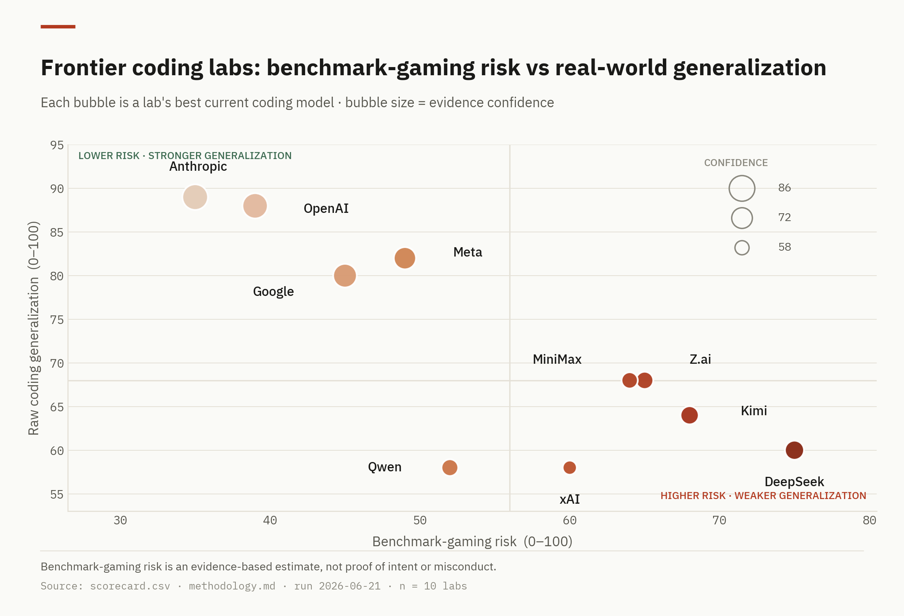

# AI Coding Benchmark Risk Graphs

A clean three-chart dashboard, generated from [`data/scorecard.csv`](data/scorecard.csv),
on benchmark-gaming risk vs raw coding generalization for frontier coding labs.

The charts are drawn in a minimal, editorial "data-science" style (warm off-white canvas,
single red→stone risk ramp, IBM Plex Sans / Mono) and exported as both **PNG** (for posts /
Substack) and **SVG** (for editing). Open [`index.html`](index.html) via GitHub Pages to view
the full dashboard.

## The charts

| # | File | Reads |
|---|------|-------|
| 01 | `01_risk_vs_generalization.png` · `.svg` | Quadrant scatter — risk (x) vs generalization (y), bubble size = confidence |
| 02 | `02_highest_risk_ranking.png` · `.svg` | Ranked bars — labs ordered by benchmark-gaming risk |
| 03 | `03_risk_generalization_gap.png` · `.svg` | Dumbbell — the gap between demonstrated skill and risk, per lab |



`benchmark_graphs_pack.zip` bundles all six image files plus the source CSV.

## Rebuilding the charts

The full render pipeline lives in [`render/`](render/):

```bash
# one-time: fetch the IBM Plex fonts (already bundled in render/fonts/)
bash render/fetch_fonts.sh

# render all charts -> 0N_*.png and 0N_*.svg in the repo root
python3 render/make_charts.py
```

Requires Python 3 with `matplotlib`, `pandas`, and `numpy`.
[`render/chartkit.py`](render/chartkit.py) holds the shared "Editorial Light" style system
(palette, typography, header/footer helpers); [`render/make_charts.py`](render/make_charts.py)
builds the three figures. Edit the data in `data/scorecard.csv` and re-run to regenerate.

## Source data

- [`data/benchmark_gaming_report.md`](data/benchmark_gaming_report.md) — full report
- [`data/scorecard.csv`](data/scorecard.csv) — scored lab/model data behind the charts
- [`data/methodology.md`](data/methodology.md) — scoring rubric and normalization rules
- [`data/sources.md`](data/sources.md) — source index

## Important caveat

Benchmark-gaming risk is an evidence-based risk estimate from public/private score gaps,
contamination exposure, scaffold dependence, and disclosure uncertainty. **It is not proof of
intent or misconduct.**
